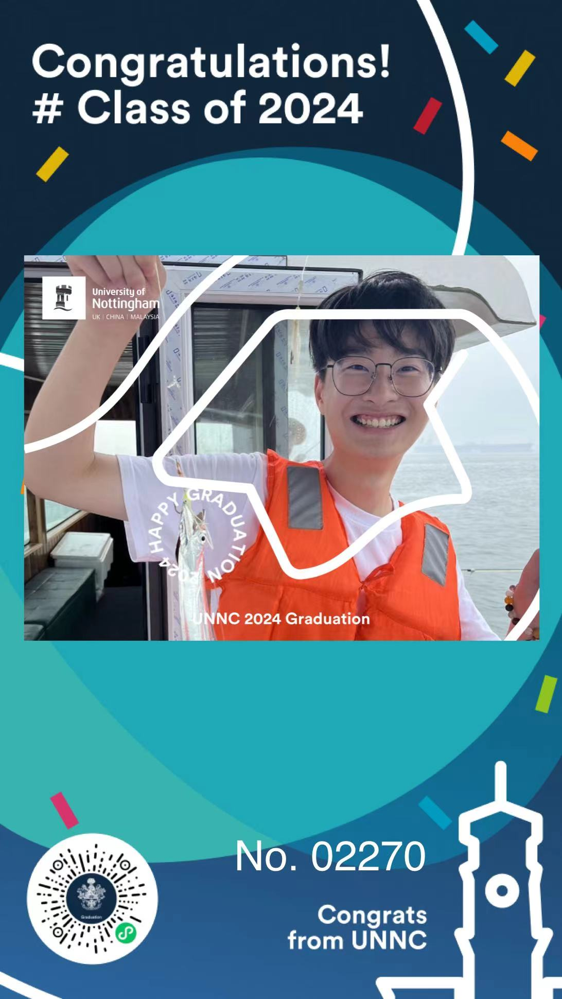

### Introduction
Happy Graduation! Personalize your graduation photos with unique frames and stickers.

### Photo Display

|  |  |  |
|-------------------------------|-------------------------------|--------------------------------|
|  |  |  |

### Project Experience Address

### Preparation Work

1. Apply for a mini program on the WeChat Public Platform [Application Address](https://mp.weixin.qq.com/)
2. Download WeChat Developer Tools [Download Address](https://developers.weixin.qq.com/miniprogram/dev/devtools/download.html)
3. Download and unzip HBuilderX [Download Address](https://www.dcloud.io/hbuilderx.html)

### Setup Work

1. Download the source code.
2. Upload the stickers or avatar frames you want to use to an image hosting service. You can choose a free online image hosting service like **Superbed** [Image Hosting Address](https://www.superbed.cn/signin) or use Tencent Cloud/Alibaba Cloud's object storage for faster access.
3. Install project dependencies, and replace the sticker and frame image addresses in the page files.
4. In the mini program background, in development management, configure the image hosting address as a legal domain. In the privacy statement, submit permissions for accessing and saving photos to the album.
5. Click upload in the WeChat Developer Tools, submit for review in the mini program background, and once approved, it will be displayed normally.

### Project Privacy Statement

1. Access to avatars to create personalized avatars.
2. Album permissions for reading and saving photos to the album.

