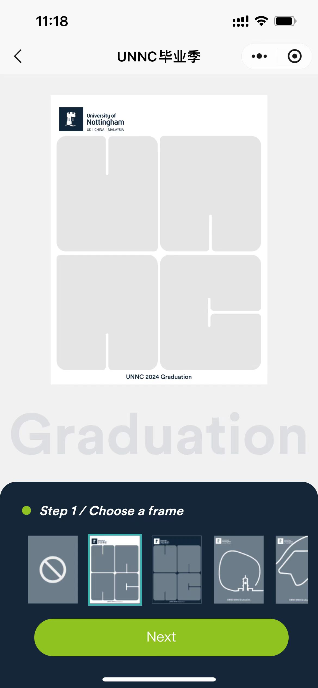
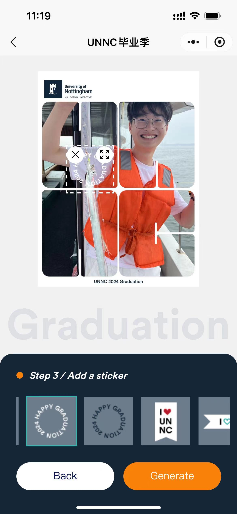
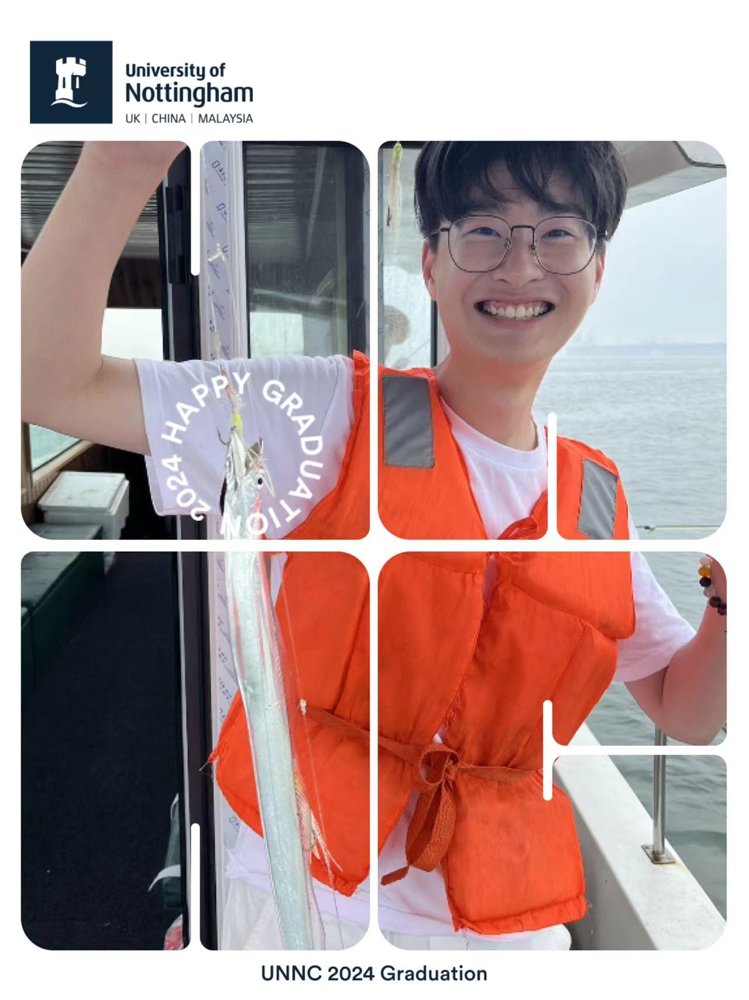

# 2024Graduation

#### 介绍
毕业快乐，快来定制你的专属毕业照!
Congratulations! Customize yourgraduation photos with uniqueframes and stickers.

#### 图片展示

|    |   |   |
|---|---|---|
|   |   |   |

#### 项目体验地址

#### 准备工作

一、微信公众平台申请一个小程序 [申请地址](https://mp.weixin.qq.com/)

二、下载微信开发者工具 [下载地址](https://developers.weixin..com/miniprogram/dev/devtools/download.html)

三、下载解压HBuilderX [下载地址](https://www.dcloud.io/hbuilderx.html)

#### 搭建工作

一、下载源码。

二、将你想使用的贴纸或者头像框上传到一个图床。你可以选择网上免费的图床  **聚合图床**  [图床地址](https://www.superbed.cn/signin)  或者使用腾讯云/阿里云的对象存储，使用对象存储获取速度会更快。

三、项目安装依赖，在page文件中替换贴纸和相框的图片地址。

四、在小程序后台，开发管理中，将图床地址配置为合法域名。在隐私说明中提交获取头像和相册读取保存权限。

五、在微信开发者工具点击上传，在小程序后台提交审核，审核通过后即可正常展示。

#### 项目隐私说明

1. 获取头像，制作个性头像。

2. 相册权限，读取，保存图片到相册。